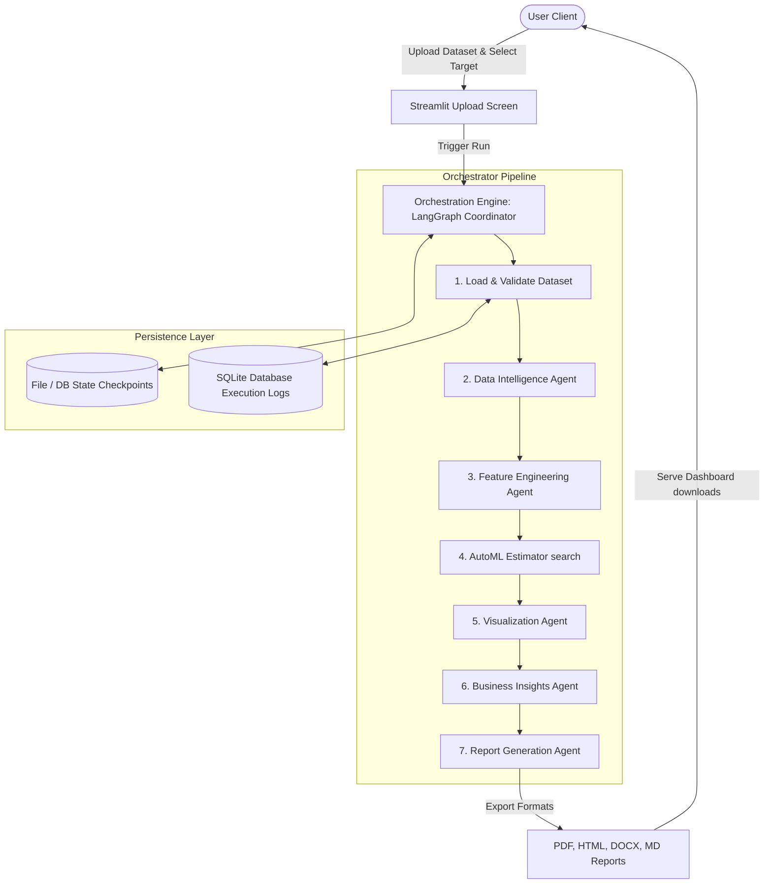

# Capstone: Multi-Agent AI Data Analyst (capstone-multi-agent-analyst)

[](https://www.python.org/)
[](LICENSE)
[](https://github.com/astral-sh/ruff)
[](https://github.com/psf/black)

A production-ready, highly scalable multi-agent artificial intelligence framework designed to ingest, clean, explore, model, and visualize dataset operations automatically. 

---

## Project Overview

The **Multi-Agent AI Data Analyst** is an advanced, production-grade artificial intelligence platform that orchestrates specialized AI agents to automate end-to-end data science workflows. By utilizing a modular cyclic state graph topology coordinated via LangGraph, the system processes structured datasets, performs exploratory statistical profile analysis, runs feature engineering operations, trains and optimizes machine learning models (AutoML), generates rich visualization panels, and compiles human-grade executive reports in PDF, DOCX, HTML, and Markdown formats.

---

## Key System Features (Completed Phases 1–12)

*   **State-Coordinated Orchestration**: A cyclic, fault-tolerant state-machine pipeline built on LangGraph that manages checkpointing, rollback recovery, and audit tracking.
*   **Intelligent Data Ingestion & Profiling**: Automated schema inference, missingness profiles, outlier checks, constant columns detection, and class distribution profiling.
*   **Feature Engineering Pipeline**: Dynamic target leakage detection, automatic encoding of categoricals, standard scaling, and feature selection.
*   **AutoML Engine**: Parallel model search with parameter tuning across estimators (Gradient Boosting, Random Forest, Logistic Regression, Gaussian NB, Decision Trees, K-Neighbors). Includes automated leave-one-out and stratified cross-validation for small datasets.
*   **Dynamic Visualizations**: Multi-chart visualization agent compiling missing value heatmaps, correlation grids, distributions, ROC/PR curves, and feature importance bar plots.
*   **Traceable Business Insights**: Grounded, dynamic LLM generation of executive summaries, takeaways, strategic recommendations, operational risk profiles, and confidence ratings, completely free of hardcoded domain assumptions.
*   **Professional Document Compilation**: Programmatic compilers transforming analysis summaries and assets into PDF, DOCX, HTML, and Markdown reports, with full structural verification audits.
*   **Interactive Dashboard UI**: A premium, dark-mode optimized Streamlit interface with step-by-step page routing, workflow history tracking, and interactive analysis controls.

---

## Architectural Overview

Below is the conceptual execution flow of the LangGraph state machine orchestrating the specialized agent modules:



---

## Folders & Core Modules

```
capstone-multi-agent-analyst/
├── app/                        # User interface layer (Streamlit Front-End)
│   ├── Home.py                 # Landing page & Pipeline flowcharts
│   ├── components/             # Reusable UI elements (Uploaders, Tables, Charts)
│   ├── services/               # UI Services (Session state, configuration)
│   └── pages/                  # Multipage dashboard application screens
├── src/                        # Core agentic and execution logic (Back-End)
│   ├── agents/                 # Specialized agent classes (ML, EDA, Insights, Reports)
│   ├── core/                   # Core modules (LLM clients, custom loggers, path constants)
│   ├── database/               # Database models and session managers (SQLite/SQLAlchemy)
│   ├── optimization/           # Performance layer (Lazy loaders, benchmarking, caching)
│   ├── orchestration/          # LangGraph state machine, nodes, and routers
│   ├── repositories/           # Database entity access repositories
│   └── schemas/                # Strict Pydantic API and data validation models
├── workspace/                  # Dynamic local database and reports folder (Git ignored)
├── tests/                      # Pytest automated test scripts
└── pyproject.toml              # Project dependencies, packaging, and lint configs
```

---

## Installation & Running Instructions

### 1. Environment Setup

```bash
# Clone the repository
git clone <repository_url>
cd capstone-multi-agent-analyst

# Create the virtual environment
python -m venv .venv
# Activate (Windows PowerShell):
.venv\Scripts\Activate.ps1
# Activate (macOS/Linux):
source .venv/bin/activate

# Install requirements
pip install -r requirements.txt
```

### 2. Launch the Streamlit Dashboard

Start the application dashboard locally:
```bash
streamlit run app/Home.py
```
Open your browser and navigate to: **`http://localhost:8501`**

### 3. Run Automated Tests

To verify code correctness, run the test suite containing **103 unit and integration tests**:
```bash
python -m pytest
```

---

## Static Code Audits & Coding Standards

To enforce code quality, run Black, Ruff, and MyPy checkers:

```bash
# Run Ruff linting check
ruff check .

# Apply automatic formatting using Black
black .

# Run static type checks
mypy .
```

---

## License

This project is licensed under the MIT License - see the [LICENSE](LICENSE) file for details.
