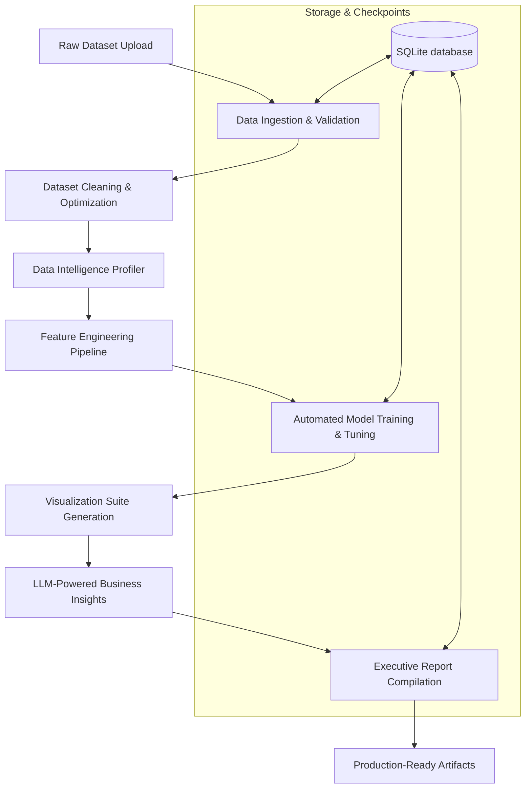

# Multi-Agent AI Data Analyst

[](https://www.python.org/downloads/)
[](https://opensource.org/licenses/MIT)
[](https://www.docker.com/)
[](https://github.com/example/capstone-multi-agent-analyst/actions)

An enterprise-grade, fully reproducible **Multi-Agent AI Data Analyst** platform. It automates end-to-end data analysis workflows: from raw dataset cleaning, schema validation, feature engineering, and model training (regression, classification, multiclass) to generating visualizations, business insights, and compiled PDF/DOCX executive reports.

Structured around a directed acyclic execution graph powered by **LangGraph**, the system utilizes specialized AI agents at each lifecycle node, persisting execution checkpoints to an SQLite database for seamless workflow recovery, pausing, and resuming.

---

## 🚀 Key Features

*   **Robust Ingestion & Schema Auditing**: Checks uploads for file structures, null counts, cardinalities, and identifies anomalies.
*   **Automatic Cleaning & Optimization**: Implements dataset-driven column filters, handles missing values, and optimizes memory usage.
*   **Production-Grade Feature Engineering**: Automates scaling, encoding, and target-correlated feature selection.
*   **Automated Machine Learning (AutoML)**: Sweeps algorithms (XGBoost, LightGBM, CatBoost, Scikit-Learn) with cross-validation and Leave-One-Out fallbacks for small samples.
*   **Visualizations Suite**: Generates correlation matrices, distribution plots, and missingness heatmaps.
*   **GenAI Business Insights**: Utilizes LLMs (OpenAI, Gemini, Anthropic) to produce executive findings and text-based summaries.
*   **Executive Report Compilation**: Compiles Markdown, assets, and charts into PDF, DOCX, and HTML reports via WeasyPrint.
*   **Durable State Checkpointing**: Supports saving and resuming workflows using DB-backed checkpoint stores.

---

## 🏛️ System Architecture

The following diagram illustrates the flow of a dataset through the execution graph:



---

## 🛠️ Quick Start

### 1. Prerequisites
Ensure you have the following installed:
*   [Python 3.12](https://www.python.org/downloads/)
*   [Docker & Docker Compose](https://www.docker.com/)

### 2. Running Locally
Clone the repository and prepare the workspace:
```bash
# Clone the repository
git clone https://github.com/example/capstone-multi-agent-analyst.git
cd capstone-multi-agent-analyst

# Copy the environment template
cp .env.example .env

# Create and activate virtual environment
python -m venv .venv
source .venv/bin/activate  # On Windows: .venv\Scripts\activate

# Install requirements
pip install --upgrade pip
pip install -r requirements.txt
```

Start the Streamlit dashboard:
```bash
streamlit run app/Home.py
```

---

## 🐳 Docker Deployment

The platform is containerized using Docker and orchestrated with Docker Compose.

### Local Development (Hot Reloading)
To run the local developer container with code volume mapping and automatic hot-reloading:
```bash
docker compose up --build
```
Access the dashboard at [http://localhost:8501](http://localhost:8501).

### Production Deployment (Nginx Reverse Proxy)
To launch the production candidate secure stack containing Nginx proxying to the Streamlit app:
```bash
docker compose -f docker-compose.prod.yml up --build -d
```
Access the gateway on standard HTTP port 80: [http://localhost](http://localhost).

---

## ⚙️ Configuration Setup

Configure runtime parameters in the local `.env` file:

| Variable | Description | Default |
| :--- | :--- | :--- |
| `OPENAI_API_KEY` | OpenAI API Authentication Token | *Required for OpenAI models* |
| `GEMINI_API_KEY` | Gemini API Authentication Token | *Optional* |
| `ANTHROPIC_API_KEY`| Anthropic API Authentication Token | *Optional* |
| `DATABASE_URL` | SQLite Connection URI | `sqlite:///./workspace/data.db` |
| `WORKSPACE_DIR` | Base workspace output folder | `./workspace` |
| `LOG_LEVEL` | Application logging granularity | `INFO` |

---

## 🧪 Verification & Testing

Verify system integrity using the Pytest suite (includes E2E, integration, and performance profiles):
```bash
# Run the complete test suite (127 checks)
python -m pytest

# Run with test coverage
python -m pytest --cov=src --cov-report=term-missing
```

---

## 📂 Project Structure

```
├── .github/workflows/      # CI/CD automated actions
├── app/                    # Streamlit pages and UI components
├── benchmarks/             # Scalability performance tests & runs
├── docs/                   # Full documentation manuals
├── logs/                   # System runtime logs (with daily rotations)
├── portfolio/              # Interview preparation and highlights
├── src/                    # Primary application packages (orchestration, agents, core)
├── workspace/              # Dynamic data outputs, caches, and reports
├── .env.example            # Environment variables configuration template
├── docker-compose.yml      # Local Compose definition
├── docker-compose.prod.yml # Production Compose reverse-proxy definition
├── Dockerfile              # Multi-stage production container setup
├── Dockerfile.dev          # Lightweight developer container setup
├── nginx.conf              # Reverse proxy gateway routing
└── pyproject.toml          # Tooling, Ruff, Black, and package metadata
```

---

## 📄 License

This project is licensed under the MIT License - see the [LICENSE](LICENSE) file for details.
