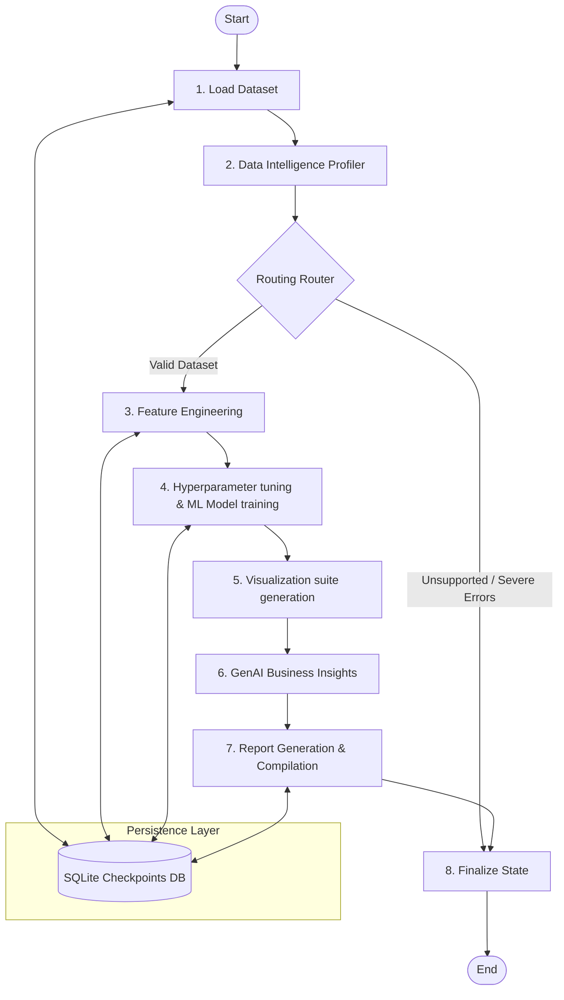
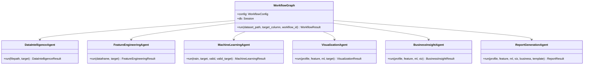
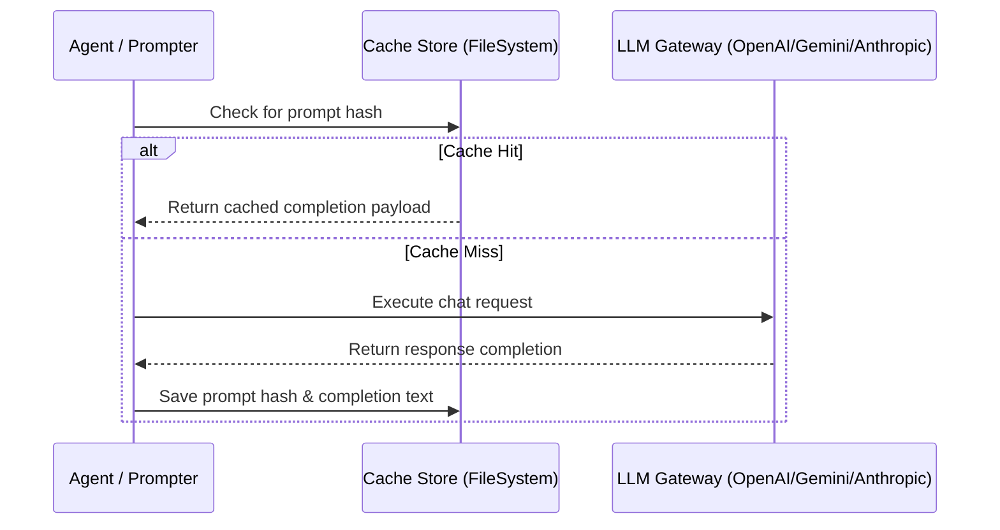
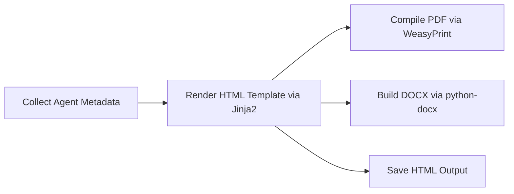

# System Architecture Design

This document details the modular system design, agent interactions, and orchestration workflow of the **Multi-Agent AI Data Analyst**.

---

## 1. High-Level Architectural Modules

The platform is designed around four key decoupled layers:
1.  **User Interface Layer (Streamlit)**: Serves as the dashboard where users upload datasets, configure targets, trigger analysis runs, and review visual reports.
2.  **Orchestration Layer (LangGraph)**: Compiles the directed acyclic graph defining node transitions, routing states dynamically based on dataset characteristics, and writing execution checkpoints.
3.  **Agent Intelligence Layer (Specialized Agents)**: Modules coordinating specific actions (profiling, cleaning, model training, visualization, insights, reporting).
4.  **Database & Storage Layer (SQLAlchemy ORM + SQLite)**: Records datasets, logs workflow execution history, and manages checkpoint records.

---

## 2. Agent Interaction & Graph Workflow

The execution graph is structured as a **LangGraph StateGraph** consisting of nodes representing each agent's execution. Transitions between nodes are governed by conditional routes.

---

## 3. Specialized AI Agent Subsystems

Each agent operates as an isolated component, consuming state parameters and returning state updates:

---

## 4. LLM Caching Strategy

To minimize latency and LLM token usage, the platform features a file-system cached retrieval layer. If the cache directory is configured, repeat requests with matching prompt signatures bypass API calls.

---

## 5. Report Compilation Pipeline

The report generation agent builds multi-format files in three sequential phases:

